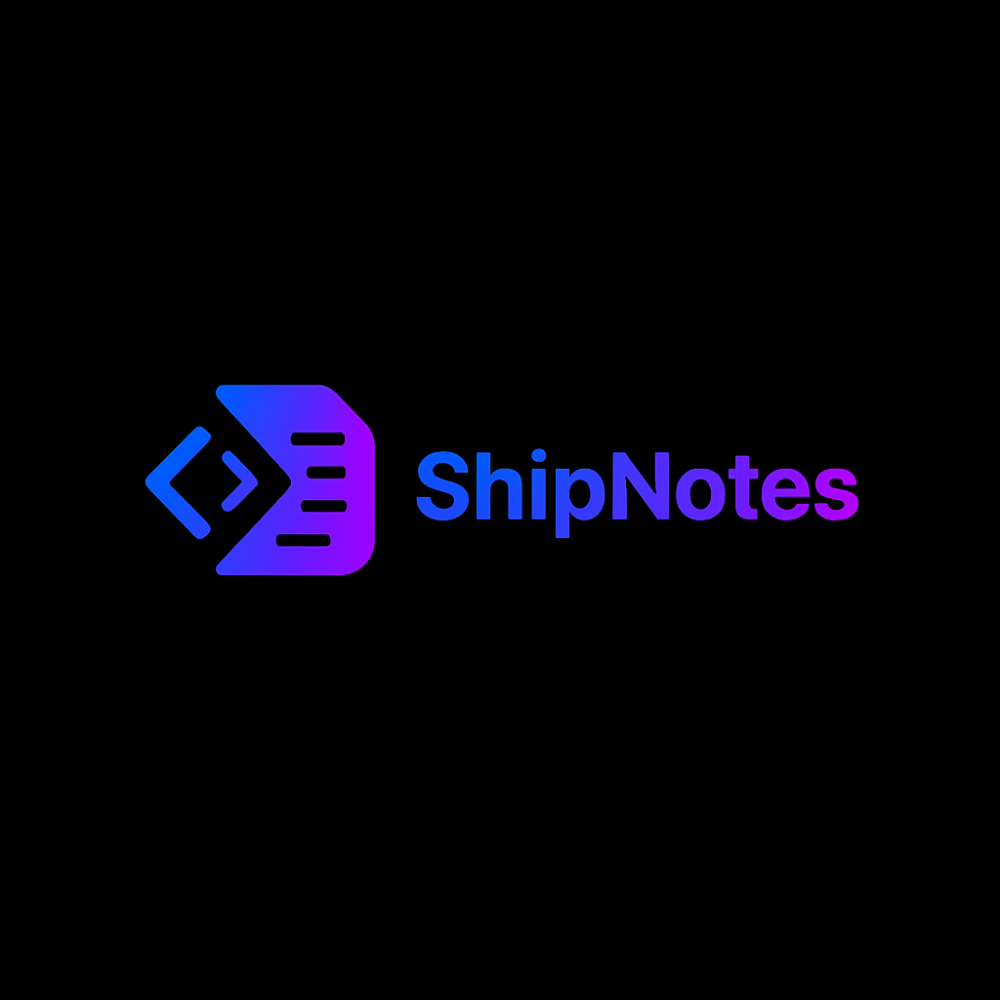

<div align="center">
  

  <h1>ShipNotes</h1>
  <p><strong>Every team speaks a different language. Now they can all understand each other.</strong></p>

  [](https://nextjs.org)
  [](https://vercel.com)
  [](https://www.typescriptlang.org/)
  [](https://opensource.org/licenses/MIT)

  [Website](https://shipnotes.xyz) • [Twitter](https://x.com/ShipNotesXYZ) • [Report Bug](https://github.com/therealdansickles/shipnotes/issues)
</div>

---

## 🚀 What is ShipNotes?

ShipNotes is an AI-powered **translation layer** for development teams. It takes your git commits and translates them into updates that everyone understands—from developers to designers, executives to investors.

### The Problem

- Developers write commits in technical language: `"Refactored auth middleware for better token validation"`
- Non-technical stakeholders need it translated: `"Improved login security"`
- Manually rewriting the same update 5 different ways wastes **2-3 hours per week**
- Communication gaps lead to misalignment, missed expectations, and confusion

### The Solution

**One commit → Infinite translations.**

ShipNotes automatically generates audience-appropriate versions:
- **Developers:** Technical details, implementation specifics
- **Designers:** UX impact, visual changes
- **Executives:** Business value, ROI, strategic alignment
- **Investors:** Growth metrics, security improvements
- **End Users:** Clear benefits without jargon

---

## ✨ Features

- 🔗 **GitHub Integration** - Connect your repos with OAuth
- 🤖 **AI-Powered Translation** - Smart conversion using GPT-4
- 👥 **Multi-Stakeholder Support** - Customize for each audience
- ⚡ **Instant Generation** - 30 seconds vs 30 minutes manually
- 📊 **Usage Tracking** - Monitor changelog history
- 🎨 **Beautiful Output** - Professional formatting with emojis
- 🔒 **Secure & Private** - Your code never leaves your control

---

## 🛠️ Tech Stack

- **Frontend:** [Next.js 16](https://nextjs.org) (App Router) + TypeScript
- **Styling:** [Tailwind CSS](https://tailwindcss.com) + [shadcn/ui](https://ui.shadcn.com)
- **Database:** [Supabase](https://supabase.com) (PostgreSQL)
- **Auth:** GitHub OAuth via [Privy](https://privy.io)
- **AI:** [OpenAI API](https://openai.com) (GPT-4o-mini)
- **Payments:** [Stripe](https://stripe.com)
- **Deployment:** [Vercel](https://vercel.com)

---

## 🎯 Use Cases

### 🚀 Fast-Moving Startups
Non-technical founders need to understand what engineering is shipping without weekly status meetings.

### 🎨 Creative Agencies
Dev teams + design teams + clients all need project updates in their own language.

### 📦 Product Teams
Engineering ships features → Product/Design need impact summaries → Stakeholders need business context.

### 🌐 Web3 Projects
Technical core team → Community-focused communication without losing the technical depth.

---

## 🏃 Getting Started

### Prerequisites

- Node.js 18+ and npm
- Supabase account
- GitHub OAuth app
- OpenAI API key

### Installation

1. **Clone the repository**
   ```bash
   git clone https://github.com/therealdansickles/shipnotes.git
   cd shipnotes
   ```

2. **Install dependencies**
   ```bash
   npm install
   ```

3. **Set up environment variables**
   ```bash
   cp .env.example .env.local
   ```

   Fill in your environment variables:
   ```env
   NEXT_PUBLIC_SUPABASE_URL=your_supabase_project_url
   NEXT_PUBLIC_SUPABASE_ANON_KEY=your_supabase_anon_key
   SUPABASE_SERVICE_ROLE_KEY=your_supabase_service_role_key
   GITHUB_CLIENT_SECRET=your_github_oauth_client_secret
   OPENAI_API_KEY=your_openai_api_key
   STRIPE_SECRET_KEY=your_stripe_secret_key
   STRIPE_WEBHOOK_SECRET=your_stripe_webhook_signing_secret
   ```

4. **Set up Supabase database**

   Run the SQL migrations in `supabase/migrations/` to create the required tables.

5. **Run the development server**
   ```bash
   npm run dev
   ```

   Open [http://localhost:3000](http://localhost:3000) in your browser.

---

## 📂 Project Structure

```
shipnotes/
├── app/                    # Next.js App Router pages
│   ├── api/               # API routes
│   ├── blog/              # Blog posts (SEO content)
│   ├── dashboard/         # User dashboard
│   └── ...
├── components/            # React components
│   └── ui/               # shadcn/ui components
├── lib/                   # Utility functions
│   ├── github.ts         # GitHub API integration
│   ├── openai.ts         # AI prompt engineering
│   ├── supabase.ts       # Database client
│   └── ...
├── public/               # Static assets
└── supabase/            # Database migrations
```

---

## 🤝 Contributing

We welcome contributions! Here's how you can help:

1. **Fork the repository**
2. **Create a feature branch** (`git checkout -b feature/amazing-feature`)
3. **Commit your changes** (`git commit -m 'Add some amazing feature'`)
4. **Push to the branch** (`git push origin feature/amazing-feature`)
5. **Open a Pull Request**

### Development Guidelines

- Follow the existing code style (TypeScript + ESLint)
- Write clear commit messages (Conventional Commits format)
- Add tests for new features when applicable
- Update documentation as needed

---

## 🐛 Bug Reports & Feature Requests

Found a bug or have an idea? [Open an issue](https://github.com/therealdansickles/shipnotes/issues) and we'll address it as soon as possible.

---

## 📜 License

This project is licensed under the **MIT License** - see the [LICENSE](LICENSE) file for details.

---

## 🌟 Show Your Support

If ShipNotes helps you communicate better with your team:

- ⭐ **Star this repo** on GitHub
- 🐦 Follow [@ShipNotesXYZ](https://x.com/ShipNotesXYZ) on Twitter
- 📣 Share ShipNotes with your team
- 🙏 Spread the word about the "translation layer" concept

---

## 🔗 Links

- **Website:** [shipnotes.xyz](https://shipnotes.xyz)
- **Twitter:** [@ShipNotesXYZ](https://x.com/ShipNotesXYZ)
- **GitHub:** [therealdansickles/shipnotes](https://github.com/therealdansickles/shipnotes)
- **Issues:** [Report a bug](https://github.com/therealdansickles/shipnotes/issues)

---

## 💬 Community

Questions? Want to chat? Reach out:

- Twitter DMs: [@ShipNotesXYZ](https://x.com/ShipNotesXYZ)
- Email: hello@dpopstudios.xyz
- GitHub Issues: [Ask a question](https://github.com/therealdansickles/shipnotes/issues/new)

---

<div align="center">
  <p>Built with ❤️ by <a href="https://x.com/ShipNotesXYZ">dpop Studios</a></p>
  <p><strong>Translate your code for every team.</strong></p>
</div>
